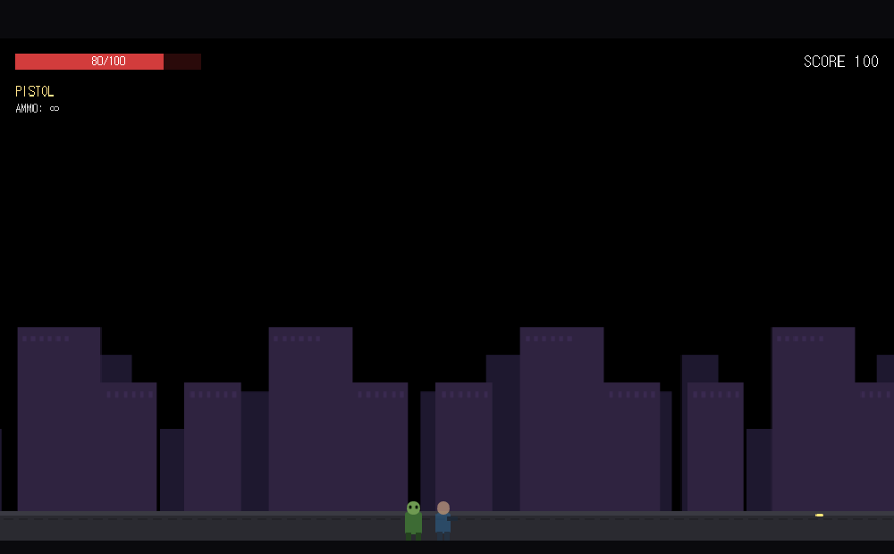

# DEADLINE: OUTBREAK

**[English](README.md)**

브라우저에서 바로 실행되는 2D 사이드 스크롤 좀비 런앤건. 정적 GitHub Pages 배포만으로 동작하며 서버·DB·로그인이 전혀 없습니다.

> 격리 작전이 실패했다. 도시는 버려지고 있다. 대피 구역으로 가는 길은 하나뿐이다.



*(현재는 절차적으로 생성한 placeholder 아트입니다 — 최종 픽셀 아트는 아직 적용되지 않았습니다.)*

## 진행 상태

현재는 플레이 가능한 초기 **버티컬 슬라이스** 단계입니다: 메뉴 → 이동/점프 → 권총 사격 → Walker·Runner 좀비 → 피격/사망 → 점수, 짧은 테스트 거리 하나로 구성되어 있습니다. 전체 레벨(다양한 무기, 추가 감염체, 미니보스, 보스)은 이 위에 계속 쌓아 올릴 예정입니다. 전체 설계 스펙과 마일스톤 계획은 [CLAUDE.md](CLAUDE.md)를 참고하세요.

## 조작법

| 동작 | 기본 키 | 대체 키 |
|---|---|---|
| 이동 | `A` / `D` | 방향키 |
| 점프 | `Space` | `X` |
| 크라우치(웅크리기) | `S` | 아래 방향키 |
| 사격 | `J` | `Z` |
| 대시 / 회피 | `Shift` | — |
| 일시정지 | `Esc` | — |

입력은 즉각 반응합니다 — 플랫포밍을 관대하게 느끼게 해주는 의도된 점프 버퍼링/코요테 타임 구간을 제외하면 별도의 입력 지연이 없습니다.

## 주요 기능 (현재 슬라이스 기준)

- 아케이드풍의 빠른 이동감: 가속/감속, 코요테 타임, 점프 버퍼링, 가변 점프 높이, 무적 프레임이 있는 대시, 크라우치.
- 데이터 기반 무기 시스템(현재 권총 구현, SMG/샷건/AR/화염방사기/로켓/수류탄 예정) — 머즐 플래시, 탄피 배출, 반동, 화면 흔들림 포함.
- 데이터 기반 좀비 AI(Walker, Runner) — 공용 상태머신과 공격 슬롯 매니저로, 다수의 좀비가 몰려와도 불공정하게 한꺼번에 공격하지 않도록 조절.
- 히트 스탑, 피격 플래시, 넉백, 처치 시 풀링된 파티클 이펙트.
- HUD(HP·무기·탄약·점수·콤보), 일시정지 오버레이, 재도전 버튼이 있는 게임오버/레벨클리어 오버레이.
- LocalStorage: 최고 점수와 고어(잔인 묘사) ON/REDUCED 설정 저장. 백엔드는 일절 없음.
- 패럴랙스 도시 배경, 절차적으로 생성한 placeholder 아트(최종 픽셀 아트 적용 전까지 텍스처 누락 위험 없음).

## 로컬 개발

```bash
npm install
npm run dev       # http://localhost:5173
npm run build     # 타입 체크 후 dist/ 로 빌드
npm run preview   # 빌드 결과물을 로컬에서 미리보기
```

## 배포 (GitHub Pages)

`main` 브랜치에 push하면 [.github/workflows/deploy.yml](.github/workflows/deploy.yml) 워크플로가 실행되어 앱을 빌드하고 GitHub 공식 Pages 액션으로 `dist/`를 배포합니다. 저장소의 **Settings → Pages**에서 **Source**를 **GitHub Actions**로 한 번만 설정해두면, 이후 `main`에 push할 때마다 자동으로 배포됩니다.

`vite.config.ts`는 `base: './'`를 사용하므로 빌드된 에셋 경로가 상대 경로로 유지되어, 저장소 하위 경로(`https://USERNAME.github.io/REPOSITORY/`)에서 서빙될 때도 정상 동작합니다.

## 아키텍처

```text
src/
├─ main.ts                 Phaser.Game 부트스트랩
├─ game/
│  ├─ config/               balance.ts, weapons.ts, enemies.ts, gameConfig.ts — 모든 조정 가능한 수치가 이곳에 집중됨
│  ├─ scenes/                Boot → Preload → Menu → Game + UI(병렬로 동작하는 HUD 씬)
│  ├─ entities/              player/, enemies/, projectiles/
│  ├─ systems/                WeaponSystem, CameraController, FxSystem, ScoreSystem, AttackSlotManager
│  └─ utils/                  events.ts(중앙화된 EventBus), placeholderTextures.ts(절차적 아트 생성)
└─ styles/
```

씬 간 통신(GameScene ↔ UIScene)은 직접 참조하지 않고 단일 `EventBus`를 통해서만 이루어집니다. 전체 이벤트 목록은 `utils/events.ts`를 참고하세요.

## 크레딧

설계 스펙과 방향성: [CLAUDE.md](CLAUDE.md) 참고. 현재 모든 아트/오디오는 저장소 내에서 직접 생성한 원본 placeholder 콘텐츠이며(`game/utils/placeholderTextures.ts`), 제3자 저작물이나 저작권이 있는 에셋은 사용하지 않습니다. [Phaser 3](https://phaser.io/) + TypeScript + Vite로 제작되었습니다.
